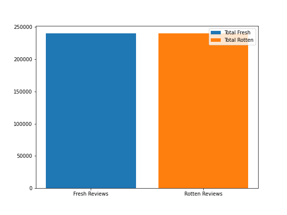
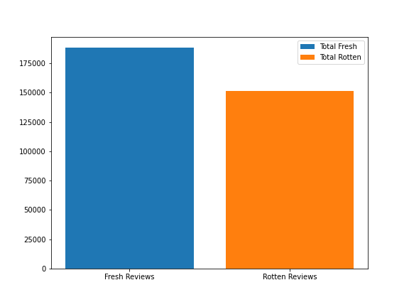
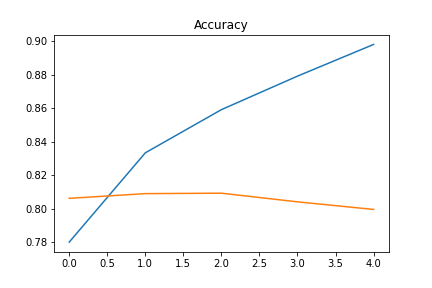
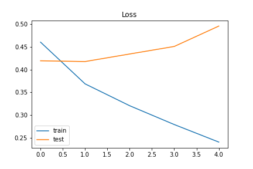

# Rotten or Not?

### Table of Contents

- [Description](#description)
- [How To Use](#how-to-use)
- [Author Info](#author-info)

---

# Description

Early on in my childhood, I loved watching movies. I remember watching The Lion King on VHS (I know, I sound terribly old with that reference), so many times that I somehow burned the actual film strip in my copy. As I matured, I critiqued movies based on their content and how well they were made. Relating to my love of movies and being able to review them, I wanted to pursue a data science project involving a process where I predicted a critic's rating of a movie based on their review. In this project, I explore how to determine a critic's freshness or rottenness using Natural Language Processing techniques. 

## About the data
This dataset was scraped from Rottentomatoes.com and placed in rotten_tomatoes_reviews.csv with there being 240k Fresh and 240k Rottent reviews.

  

There was relatively little cleaning that I had to do for this dataset, but I did implement an easier rating system. If a review was 60% or greater (fresh), they received a 1. If a review was less than 60% (rotten), they received a 0. The 2 features are listed below:
- `Freshness`: as described above, this column contains 1s and 0s pertaining to the critics score
- `Review`: critics review in string format

# Part 1: Predicting Critics Freshness
## Initial EDA
In the reviews column I found that there were multiple duplicate reviews or reviews that contained a link to a review not on Rottentomatoes.com, which I decided to solely remove the duplicates. 

  

After this, my data was decently balanced with 180k Fresh reviews and 150k rotten reviews. At this point I'm comfortable with not performing any balancing methods.

## Modeling
Initially created test, train sets for my data. Since machine learning algorithms cannot work with raw text directly, my text had to be converted into vectors of numbers. I decided against using the `bag of words` approach as it doesn't account for noise (this would include words like 'the' or 'and'). 

At this point, I am needing to find a baseline model. I will compare several different types of machine learning models to get an idea for which model works best. 

My eval metric will be accuracy, as my class distribution is similar along with True Positives and True Negatives are more important. Though, in the future I would want to use F1 scores as most real world problems are associated with imbalanced classes. 

Initial cross validation accuracy, precision, and recall scores using various models:

**Logistic Regression** | **Random Forest** | **Gradient Boosting**
----------------------- | ----------------- | --------------------
Train Set accuracy: 78.6% | Train Set accuracy: 71.3% | Train Set accuracy: 63.2%

### Hyperparameter Tuning
The methods I used for hyperparameter tuning were:
- `GridSearchCV()`
- `RandomizedSearchCV()`

**Logistic Regression** | **Random Forest** | **Gradient Boosting**
----------------------- | ----------------- | --------------------
Train Set accuracy: 85.1% | Train Set accuracy: 74.3% | Train Set accuracy: 63.2%
Test Set Accuracy: 76.2% | Test Set Accuracy: 69.1% | Test Set Accuracy: 62.7%

Although my Logistic Regression model's accuracy is performing well, I will create a neural network in hopes of improving results.

### LSTM Recurrent Neural Network
LSTM We can see dropout having the desired impact on training with a slightly slower trend in convergence and in this case a lower final accuracy. The model could probably use a few more epochs of training and may achieve a higher skill (try it an see).

**LSTM Train Set** | **LSTM Test Set** |
------------------ | ----------------- |
Accuracy: 89.9% | Accuracy: 79.4% |
Loss: 24.1% | Loss: 50.7%

  

My LSTM improved accuracy by 4.4% compared to Logistic Regression, which is great news! This means that my model is predicting True Positives and True Negatives 80% of the time.

  

Interestingly, accuracy stays somewhat constant and loss is increasing, which suggests the neural network is starting to overfit. The network is starting to learn patterns only relevant for the training set and not great for generalization. This leads to some reviews from the validation set are predicted more poorly. However, it is at the same time still learning some patterns which are useful for generalization as more and more reviews are being correctly classified.

### Next Steps
How are we able to fix the issue of overfitting the data in the future? First off, we need much more data. Maybe three to four million reviews, but that is just a start. Future comparisons of my model would include VaderSentiment and TextBlob. Thank you for going through my repo. 

## How To Use
Running `Rotten-Tomatoes/data/datasets/pyfiles/rotten.py` will scrape the data and save it to a folder in the data folder. After that, you can run `InitialModels.py` and `LSTM.py` which will instantiate models, train, predict, and give results.

---

[Back To The Top](#Table-of-Contents)

---

## Author Info

- email - [thespencerarnold@gmail.com](edward.kim9280@gmail.com)
- LinkedIn - [Spencer Arnold](https://www.linkedin.com/in/spencearnold/)

[Back To The Top](#Table-of-Contents)
As always, if you have any questions or request changes, please reach out or comment.

